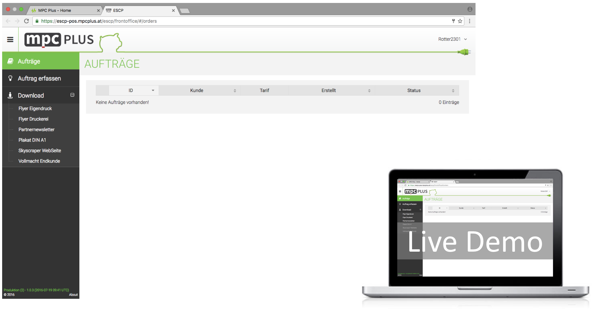
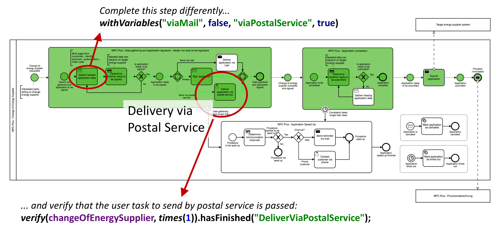

At our first meetup, Nov 22, **Christian Grashofer**, Director of [mpc PLUS](http://www.mpcplus.at) in Vienna, demoed us his company’s B2B software. 
This solution uses [Camunda](https://camunda.org) under the hoods and enables local electrical stores to offer end customers and Austrian households 
a hassle-free change-over to another energy supplier for their power and gas consumption. 

  
**Stephan Pelikan**, Software Developer at [PHACTUM](http://phactum.at) in Vienna, let us have a look into the coding details of this very same solution developed 
for mpc PLUS. He also showed us a typical development approach when using Camunda: modeling, coding, wiring stuff in the 
development project as well as unit testing of processes:

Check out their presentation, too! https://speakerdeck.com/camundavienna/christian-grashofer-stephan-pelikan-camunda-real-life-usage
